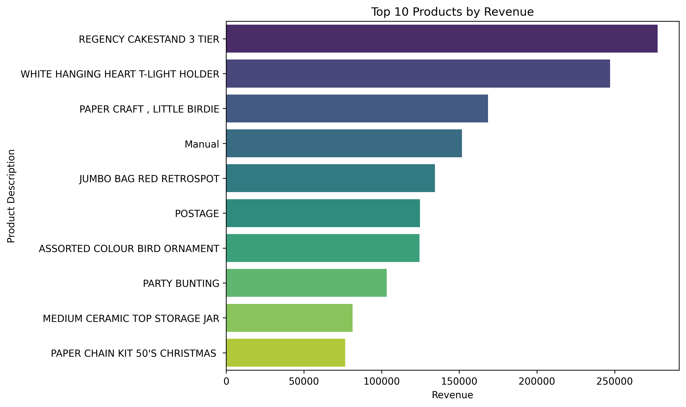
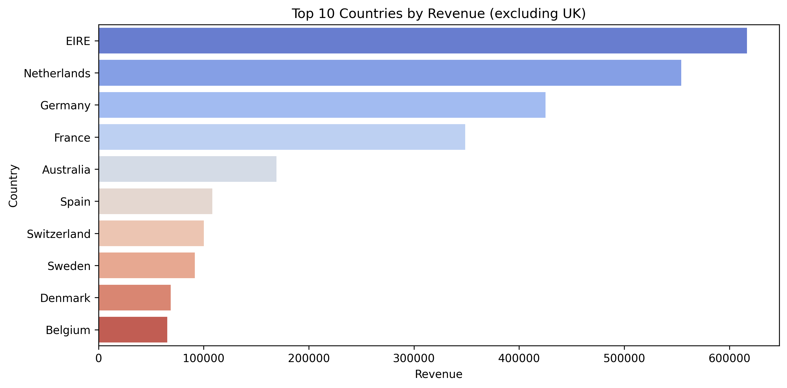
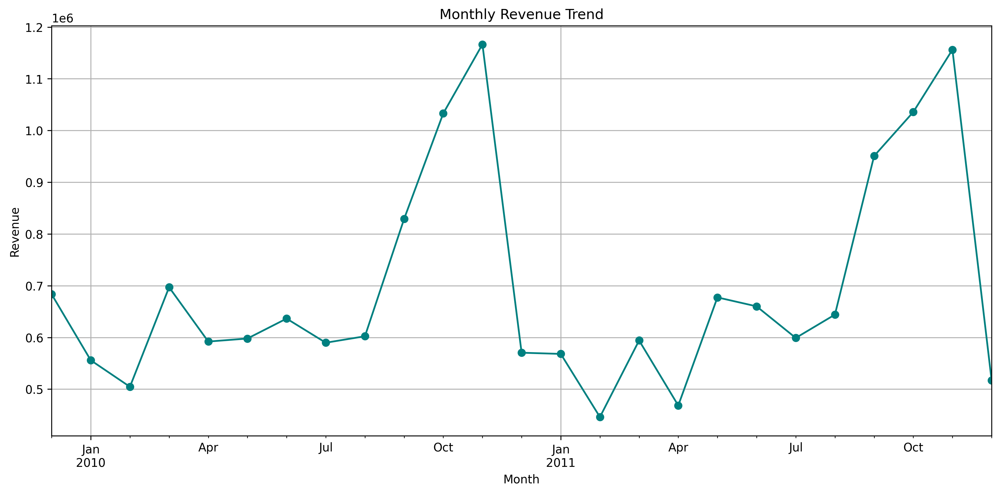
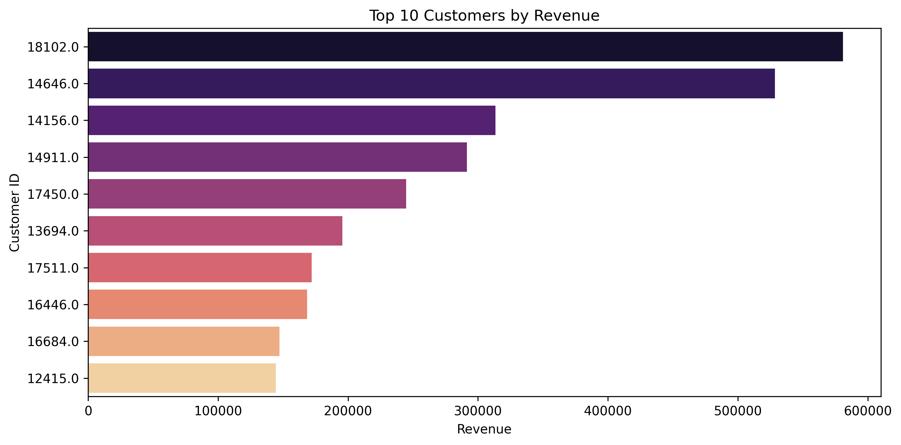

# 🛒 E-Commerce Sales Analysis (Online Retail II)

This project explores two years of e-commerce transactions to uncover key business insights such as customer behavior, product trends, and sales performance.

---

## 📊 Key Visualizations

## 🏆 Top 10 Products by Revenue

## 🌍 Revenue by Country (Excluding UK)

## 📈 Monthly Revenue Trend

## 👥 Top 10 Customers by Revenue

---

## 📁 Project Structure

Online Retail II Ecommerce_EDA/
├── data/ # Raw CSVs from Kaggle
├── images/ # Saved visualizations
├── notebook/ # Jupyter analysis notebook
└── README.md # Project overview

---

## 🧠 Tools Used
- Python (Pandas, Matplotlib, Seaborn)
- Jupyter Notebook
- Dataset: [Kaggle – Online Retail II](https://www.kaggle.com/datasets/mathchi/online-retail-ii-data-set-from-ml-repository)

---

## ✨ Insights
- High-selling products were mostly gifts and accessories.
- Revenue spikes during holidays (Nov–Dec).
- Netherlands, Germany, and France drive international sales.
- A small set of customers account for a large share of revenue.

---

